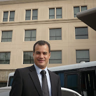

# Henry A. Flores R.

📍 Marietta, Georgia, USA
📞 +1 678-898-4114
📧 henry.flores@gmail.com | hflores30@hotmail.com

---

## About Me

Highly motivated and versatile professional with a unique background combining **Computer Engineering**, **Law (specializing in Criminal Law and Cybercrime)**, and currently pursuing a **Master's in Information Technology** at Kennesaw State University. Experienced in project management, software development, academic instruction, and legal practice focused on technology-related offenses. Seeking opportunities to leverage technical skills and analytical abilities in the IT field.

---

## Education

* **Kennesaw State University (KSU)** - Georgia, USA
    * *Master of Information Technology* (Jan 2025 - In Progress)
* **Universidad Nacional Experimental del Táchira (UNET)** - San Cristóbal, Táchira
    * *Bachelor of Science in Computer Engineering* (Completed Nov 2005, Convalidated in Colombia 2022)
    * *Associate Degree, Tele Informatics Specialist* (Completed Dec 2003)
* **Instituto Universitario de Tecnología los Andes (IUT)** - San Cristóbal, Táchira
    * *Associate Degree, Computer Technician (Systems Analysis)* (Completed Nov 1998)
* *Additional degrees and specializations in Law (Bachelor's, Master's, Specialist) focused on Criminal Law, Cybercrime, and Tax Law.*

---

## Experience

* **Graduate Research Assistant** | Kennesaw State University (KSU) | Georgia, USA _(Jan 2025 - Present)_
    * Collaborating with Dr. Valero on testing and deployment of the GlucoCheck mobile application.
    * Conducting participant surveys, analyzing user data, and contributing to glucose level forecasting models.
* **Project Manager** | EmQu | _(Nov 2022 - Dec 2024)_
    * Led projects including Fortres and PlayKout, managing teams, resources, timelines, stakeholder communication, and risk mitigation.
* **Private Attorney (Criminal Law - Cybercrime Focus)** | Independent Practice | _(Mar 2016 - Dec 2024)_
    * Conducted legal research, case analysis, and investigation focused on cybercrime and computer-related offenses.
* **Professor** | Various Institutions (Bar Association, IESIP, UCAT) | _(Oct 2002 - Sep 2024)_
    * Taught courses including Criminal Procedure, Cybercrime, Basic Computing, Programming, Computer Forensics, Telecommunications Law, Commercial Law, and Introduction to Law.
* **District Attorney (Cybercrime Prosecutor)** | Bolivarian Republic of Venezuela | San Cristóbal, Táchira _(Nov 2003 - Mar 2016)_
    * Investigated cybercrime and common crimes in the Andes Region.
    * Served as a Professor at the Prosecutor National School and speaker on cybercrime trends.
* **Developer** | C.A.D.E.L.A | San Cristóbal, Táchira _(Jan 2000 - Jun 2002)_
    * Developed and maintained a purchasing system using Visual Basic 6.0.

---

## Current Project

* **"Advances in Non-Invasive Glucose Sensing: A Comprehensive In Vitro Analysis"** _(May 2025)_
    * *Institution:* Kennesaw State University (KSU)
    * *Authors:* El Arbi Belfarsi, Henry Flores. *Advisor:* Dr. María Valero de Clemente.
    * *Description:* Exploring a non-invasive glucose monitoring approach using voltage sensing, infrared imaging, and AI models.
    * *Link:* [KSU Digital Commons](https://digitalcommons.kennesaw.edu/undergradsymposiumksu/spring2025/spring2025/257/)

---

## Skills

### Technical Skills
* **Programming:** C++, JavaScript, PHP, Python, Angular
* **Databases:** SQLite, Maria DB, MySQL, MongoDB

### Soft Skills
* Communication
* Teamwork
* Flexibility
* Confidence
* Problem Solving
* Self-management
* Project Management
* Leadership
* Emotional Intelligence

---

## Language

* **English:** 
* **Spanish:** Native

---

*(For a full list of Professional Training, Certifications, Awards, and Recognitions, please refer to my complete resume.)*
